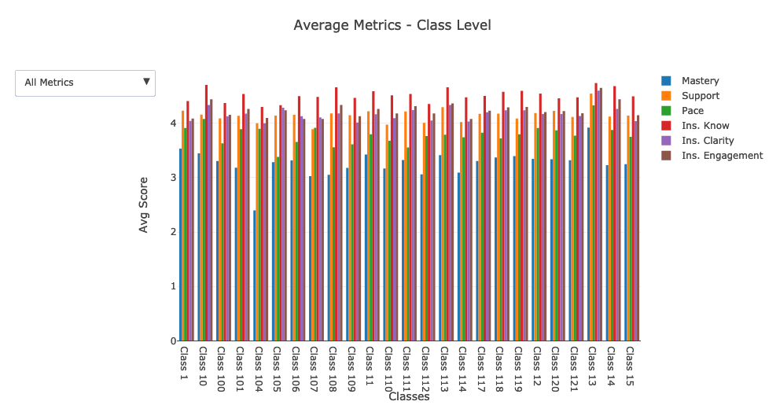
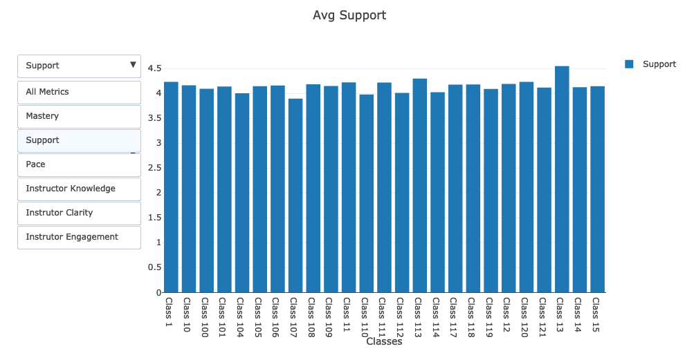
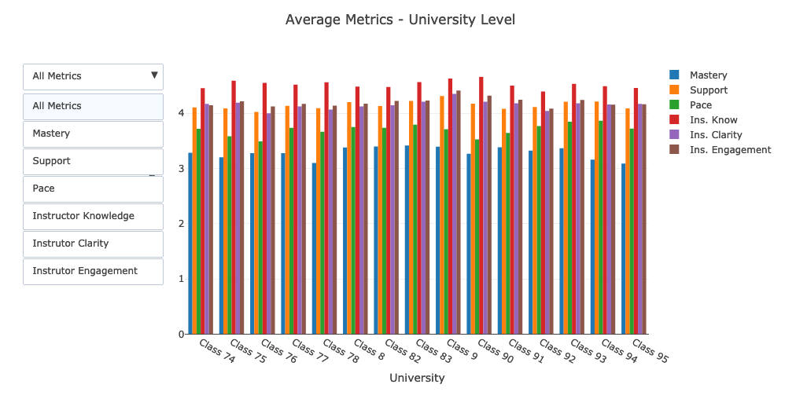
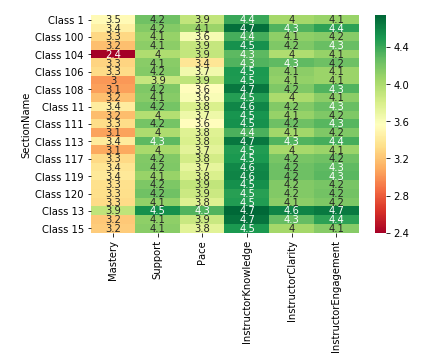
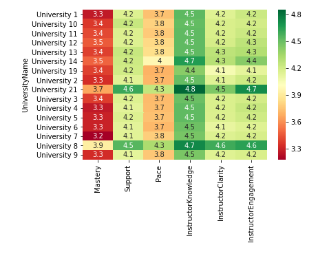
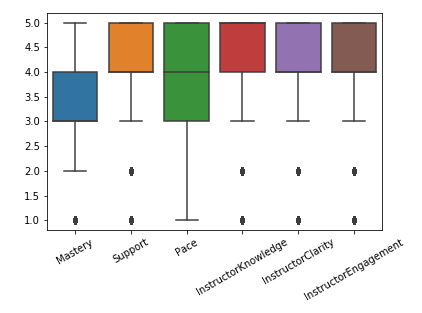

# Dashboard assignment

## Running

* Activate an Anaconda environment.

  * **Note** attached is the `environment.yml` file of the complete environment used if needed, this will take some to create so not the preferred method.

  * Run `conda env create -f environment.yml`

  * Then activate the `my_dashboard_env` environment.

  * For information for adding kernels to juptyer see the [Documentation](https://ipython.readthedocs.io/en/stable/install/kernel_install.html)

* If using your own environemnt be sure to install plotly `pip install plotly`.

* The data used is not attached due to size but can be downloaded from the Google drive.

## Data Cleaning

* First step was prepping the data from each source so that dashboards can be made from them.

* Each dashboard needs to display the average metrics for **Pace**, **Support**, **Mastery**, **Instructor Engagement**, **Instructor Clarity**, and **Instructor Knowledge**.

### SQL Clean

* This data was cleaner to work with.

* The data cleaning process:

  * Each CSV was loaded into a pandas DataFrame.

  * Merged the classes data with the student feedback data on the `SectionID`.

  * The length of the DataFrames are checked to make sure no rows are lost.

  * Merged the resulting DataFrame with the University data on `UniversityID`.

  * Pulled out the needed columns, renamed for clarity, then exported to a new CSV.

* **Note:** The new csv was exported to make the combining of the Mongo easier. Both clean up steps could take place in the same notebook if needed.

### Mongo Clean

* Noted missing values, and string values in columns.

* The data cleaning process:

  * Load the excel files in pandas DataFrames.

  * Rename columns in feedback data for clarity.

  * Dropped rows with 6 missing values in the feedback DataFrame.

  * Merged the class data with the feedback data left on `class_id` and right on `_id`.

  * Merged the resulting DataFrame with the university DataFrame left on `university_Id_x` (pandas adds both university ids on merges) and right on `_id`.

  * The length of the DataFrames are checked to make sure no rows are lost.

  * Cleaned the resulting DataFrame with the columns needed.

  * Renamed and reordered the columns to fit with the SQL created DataFrame.

* Next the Nan value needed to be handled. 88 responses were not recorded for both Instructor Clarity and Instructor Knowledge. This comes out to 0.16% of the data is missing.

* For sake of time these rows will be dropped, however in this situation it would be a team discussion on how to handle data with missing rows. Filling with 0 would throw off the metrics as a whole, and just getting averages isn't a real value.

### Combining of Data

* After getting each dataset into the same format they are each imported in. The data from the mongo datasets are then appended to the data from the SQL data sets.

## Dashboards

* The completed data from the previous step is loaded into a DataFrame.

* Pivot tables for both the class level and university level are made.

* The dashboard charts are made using plotly's python library. To make them:

  * A function is created that will take a DataFrame as an argument and create traces for all the metrics.

  * A dropdown menu is added to select which specific metrics to view.

  * There are many classes, so on top of a complete bar chart there are broken down smaller groups of classes with their own bar chart.

  

  

  * University bar graph had a more reasonable amount of values so only one chart was needed.

  

* For the additional dashboard the data this time is combined using `groupby()` with and aggregation to change it from using pivot tables.

* The rest of the charts are made using [Seaborn](https://seaborn.pydata.org/) which is a data visualization library based on matplotlib.

* The heatmaps:

  * The classes are grouped again for better visualizations.

  

  * University heatmap is shown complete.

  

* A boxplot is made with average of all metrics not grouped together by class or university.

  
